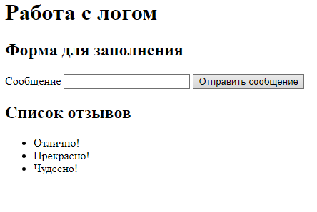
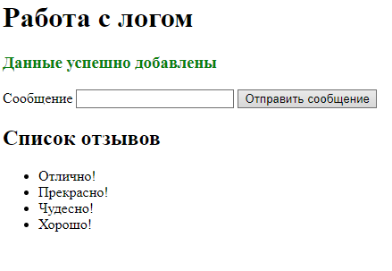
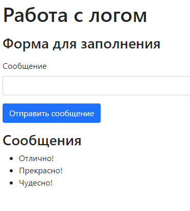
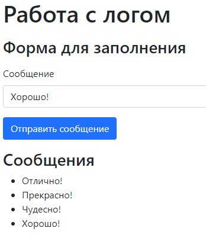

## 1. Создание журнала сообщений

### Код, отвечающий за запись данных в файл (фрагмент index.php):

```php
if ($_SERVER['REQUEST_METHOD']==='POST') {
    $r = htmlentities($_POST['message']) ?? 'Пустое сообщение';

    $f = fopen('log.txt', 'a');
    fwrite($f, $r);
    fwrite($f, "\n");
    fclose($f);

    $f = '<style>.right {width: 60%; margin-left: 35%; zoom: 80%}</style>';
    $f .= '<div class="right><h2>Добавить ещё один отзыв</h2></div>';
    echo '<h3 style="color:green">Данные успешно добавлены</h3>';
  }
```

### Код формы, собирающей данные (фрагмент index.php):

```html
<div>
  <label>Сообщение</label>
  <input id="message" name="message" required="required" type="text">
  <button type="submit">Отправить сообщение</button>
</div>
```

### Код, отвечающий за вывод результата работы кода из list.php (фрагмент index.php):

```php
echo "</form></div>";
echo "<h2>Список отзывов</h2>\n";
```

### Главная страница (index.php):

```php
<meta charset="utf-8">
<h1>Работа с логом</h1>
<?php
  $f = '<h2>Форма для заполнения</h2>';
  if ($_SERVER['REQUEST_METHOD']==='POST') {
    $r = htmlentities($_POST['message']) ?? 'Пустое сообщение';

    $f = fopen('log.txt', 'a');
    fwrite($f, $r);
    fwrite($f, "\n");
    fclose($f);

    $f = '<style>.right {width: 60%; margin-left: 35%; zoom: 80%}</style>';
    $f .= '<div class="right><h2>Добавить ещё один отзыв</h2></div>';
    echo '<h3 style="color:green">Данные успешно добавлены</h3>';
  }
  echo $f;
  echo "<div class=\"right\">";
  echo "<form method=\"post\">";
  echo <<<_END
      <div>
        <label>Сообщение</label>
        <input id="message" name="message" required="required" type="text">
        <button type="submit">Отправить сообщение</button>
      </div>
_END;
  echo "</form></div>";
  echo "<h2>Список отзывов</h2>\n";
  echo require_once('list.php');
?>
```

### Код, отвечающий за считывание данных из log.txt (list.php):

```php
<?php
  $f = fopen('log.txt', 'r');
  $list = '';
  $list .= '<ul>';
  function wrap($x){
    return '<li>'.$x.'</li>';
  }
  while (($line = fgets($f)) !== false) {
    $list .= wrap($line);
  }
  fclose($f);
  $list .= '</ul>';
  return $list;
?>
```

### Результаты выполнения работы:





## 2. Создание модифицированной версии журнала сообщений с формой на Bootstrap

### Главная страница (index.php):

```php
<html>
<head>
    <title>Работа с логом</title>
    <meta charset="utf-8">
    <link href="https://cdn.jsdelivr.net/npm/bootstrap@5.0.1/dist/css/bootstrap.min.css" rel="stylesheet" integrity="sha384-+0n0xVW2eSR5OomGNYDnhzAbDsOXxcvSN1TPprVMTNDbiYZCxYbOOl7+AMvyTG2x" crossorigin="anonymous">
    <script src="https://code.jquery.com/jquery-3.6.0.min.js"></script>
    <script src="functions.js"></script>
</head>
<body>
    <div class="container-fluid">
      <p><h1>Работа с логом</h1></p>
        <p><h3>Форма для заполнения</h3></p>
        <form id="msg-form" method="post">
            <div class="mb-3">
            <label for="message" class="form-label">Сообщение</label>
            <input type="text" id="message" class="form-control" name="message" required>
            </div>
            <button type="submit" class="btn btn-primary">Отправить сообщение</button>
        </form>
        <h3>Сообщения</h3>
        <div id="messages"></div>
    </div>
</body>
</html>
```

### Файл с функциями отображения и добавления сообщений (finctions.js):

```js
$(document).ready(function(){
    $.ajax({
        url: '/functions.php?action=list',
        method: 'GET',
        success: function(data) {
            console.log(data);
            $('#messages').append('<ul></ul>');
            data.forEach(function(msg) {
                $('#messages ul').append(`<li>${msg}</li>`);
            });
        }
    });

    $('#msg-form').on('submit', function(e) {
        e.preventDefault();
        $.ajax({
            url: '/functions.php?action=add',
            method: 'POST',
            data: $(this).serialize(),
            success: function(data) {
                if (data.status == 'success') {
                    let msg = $('#message').val();
                    msg = $(`<li>${msg}</li>`);
                    $('#messages ul').append(msg);
                }
            }
        });
    });
});
```

### Файл с функциями добавления и прочтения сообщений (functions.php):

```php
<?php
    header('Content-Type: application/json');

    function add_message() {
        $msg = htmlentities($_POST['message']);
        $msg = !empty($msg) ? $msg : 'Пустое сообщение';

        $f = fopen('log.txt', 'a');
        fwrite($f, $msg);
        fwrite($f, "\n");
        fclose($f);

        echo json_encode(array('status' => 'success'));
    }
    
    function list_messages() {
        $f = fopen('log.txt', 'r');
        if (!$f) {
            echo 'Ошибка чтения файла.';
            return;
        }
        $messages = [];
        while (($line = fgets($f)) != false) {
            array_push($messages, $line);
        }
        echo json_encode($messages);
        fclose($f);
    }

    if ($_GET['action'] == 'add') add_message();
    else if ($_GET['action'] == 'list') list_messages();
?>
```

### Результаты выполнения работы:





## Вывод:

В ходе выполнения лабораторной работы были получены навыки работы с языком программирования php и ajax.

Были созданы две версии журнала сообщений: простая и модифицированная, с bootstrap-формой.
